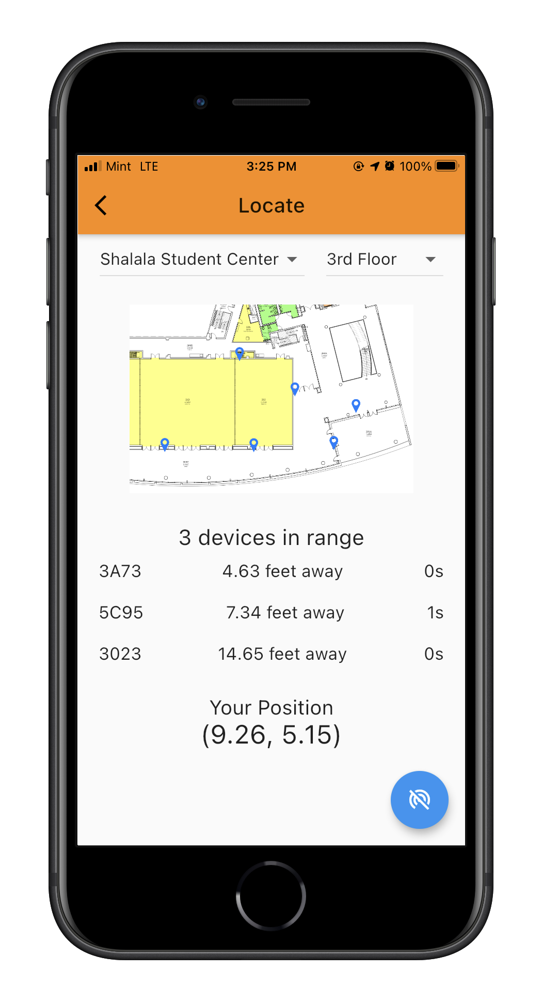

# Locus - Location Detection and Navigation

## Overview

Enhance indoor location tracking and wayfinding through the Locus mobile application and Bluetooth mesh network. 
With small Locus devices placed strategically around a space, mobile application users can view their precise position - down to the specific floor and room in a building.

## License

This project is licensed under GPL-3.0 license. See the [LICENSE](LICENSE) file for more details.
